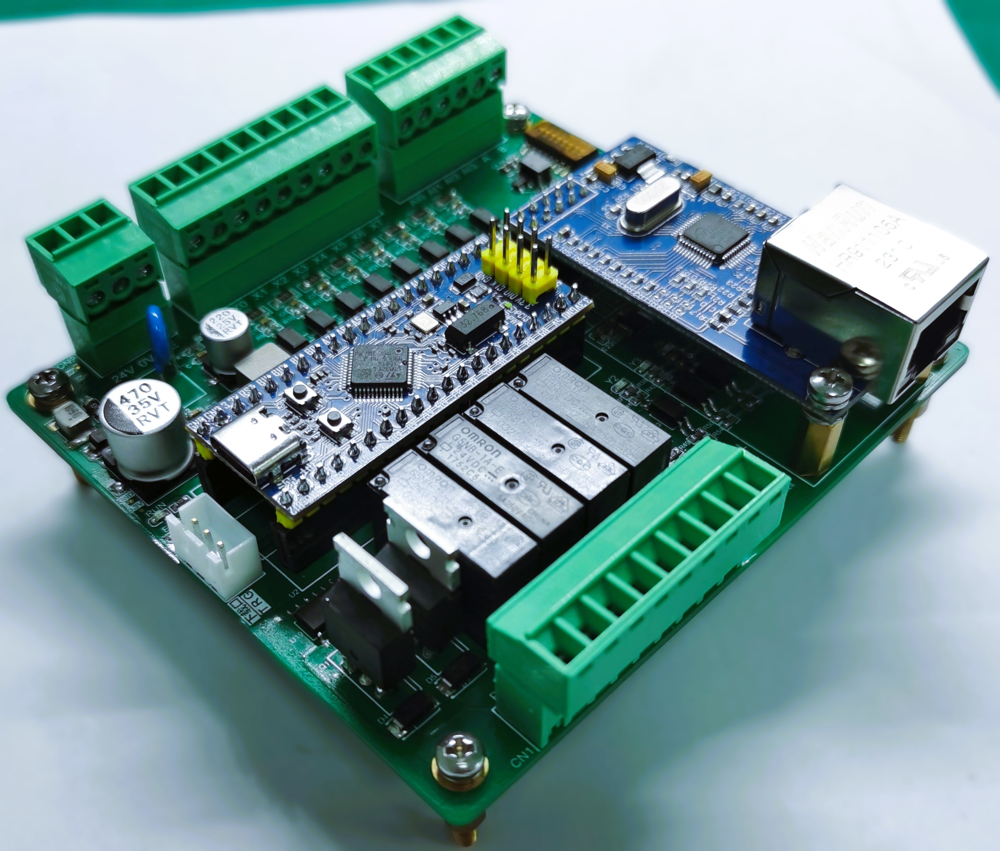
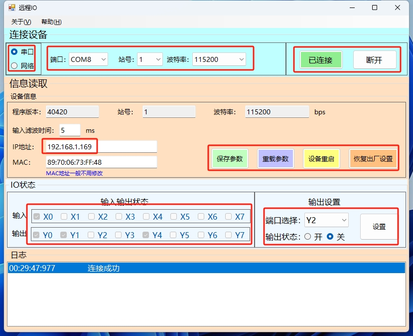

# Modbus远程IO模块调试指南

## 1. 硬件准备

- 需要远程IO模块。
- 需要一台电脑，用于连接模块并进行调试。
- 需要USB转RS485转换器或以太网线，用于连接电脑和模块。

## 2. 软件准备

- 打开本软件。

## 3. 连接模块  

- 通过RS485转换器或者以太网线连接模块和电脑。  

## 4. 通信  配置
- 使用RS485调试
  - 选择串口(RS485)
  - 选择串口号，根据硬件设置来选择站号，波特率。
- 使用以太网调试
  - 选择网络
  - 设置IP地址，默认192.168.1.168  

## 5. 连接和断开模块  

- 点击“连接”按钮，连接模块。  
- 点击“断开”按钮，断开模块。  

## 6. 输入输出监控  

- 连接模块后，软件会自动以500ms间隔轮询输入输入输出寄存器，并刷新状态。  

## 7. 输出端口调试  

- 选择输出端口（Y0-Y7）
- 选择设置开或关状态
- 点击设置按钮，设置输出状态。  